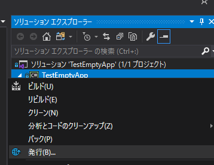
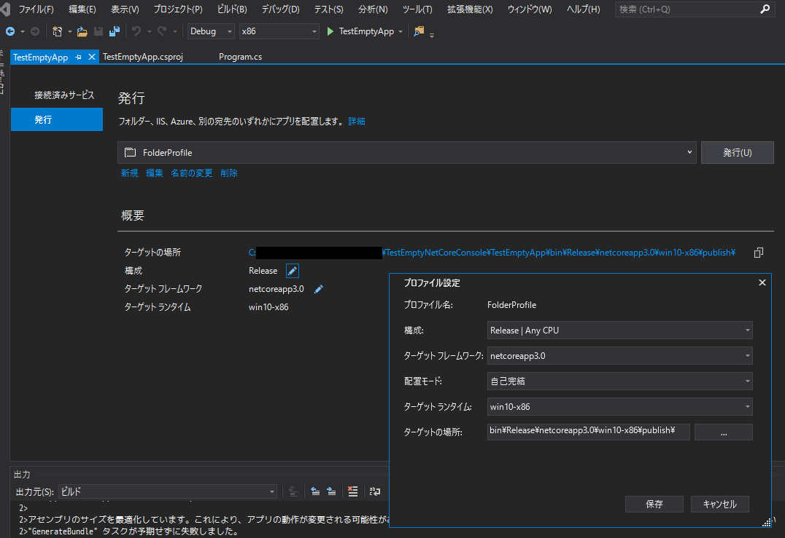

# TestEmptyNetCoreConsole

.NET Core 3.0の機能を用いて単一Exeファイル、かつTrimされたコンソールアプリケーションを作成する最小限のプロジェクトです。

## 発行手順

ソリューションエクスプローラでプロジェクトを右クリックして`発行`を選択します。

プロファイルの種類を聞かれるので、フォルダプロファイルを選択し、適当なフォルダを出力先に指定します。

また、プロファイルの設定を開き、次のように指定します。構成マネージャでは「x86」を選択します。

以上の設定をおこない、上記画像中の`発行`ボタンを押すと、単一ファイル化されたexeファイルが出力されます。

このexeファイルはいわゆる自己完結型(Self-Contained)であるため、.NET Core 3.0が未インストールの環境に持ち込んでも動作するはずです。

正常に動作すればビルド成功です。
